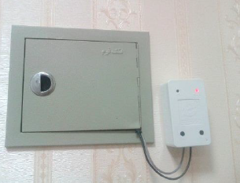
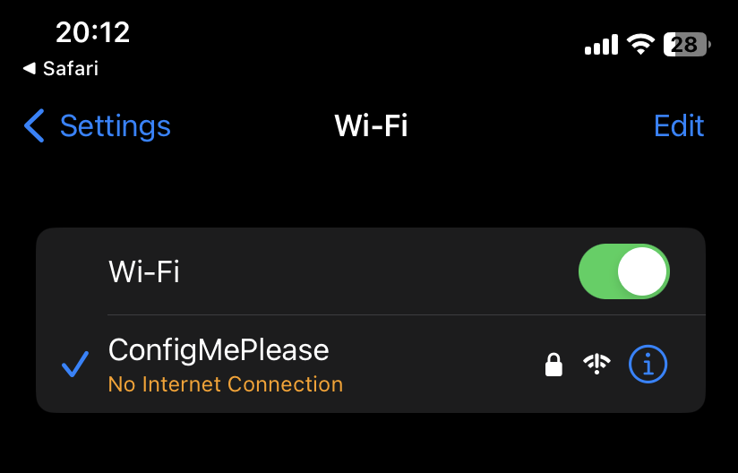
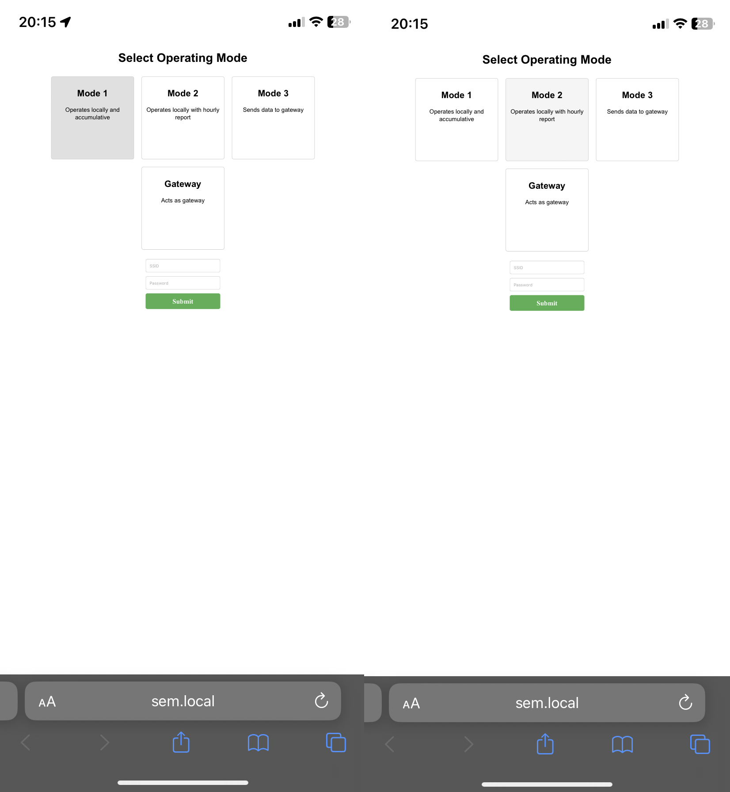
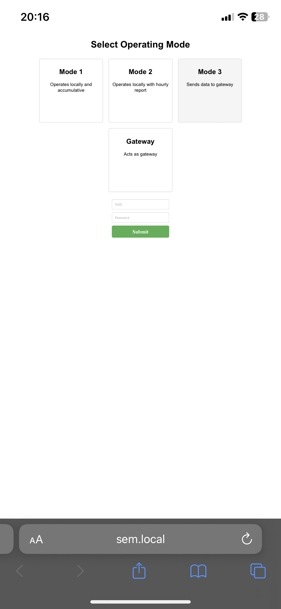
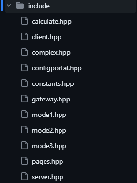

# Smart Energy Monitor (SEM)
> An implementation of different modes of SEM IOT project.
* [Introduction](#Introduction)
* [Getting Started](#Getting-Started)
* [Includes](#Includes)
* [Mode1](#Mode1)
* [Mode2](#Mode2)
* [Mode3](#Mode3)
* [Gateway](#Gateway)


## Introduction
The whole project is for measuring and monitoring energy of home devices. It can show some statistics information about electric devices energu usage.
The part that is implemented in this repository is 4 different modes of this project. the SEM device can be operated in 4 different modes.

## Getting-Started
First of you have to connect device into urban electrisity.




Then go to Wifi setting of your phone or computer. Connect to <CPonfigMePlease>



Go to your browser and enter <sem.local>
The page containes 3 modes plus 1 gateway mode.
### Mode 1,2
Mode 1,2 is for local mode of device using mobile App. The differene of this 2 modes is in the data which is calculated.
In mode 1 its aggregate energy, but in mode 2 the data is per hour.
In order to work in these modes you have to enter SSID and Password which you want to use for your device. 
In mode 1,2 you device works as an Access Point.

 

### Mode 3
In the third mode your device works as a node. It should be connected into a SSID and use it as a gateway. So you should enter SSID and Password of a router or external network.



### Mode 4(Gateway)
The last mode is gateway mode. SEM device is a gateway here. So you should enter SSID and Password of a router or external network.
Here you should enter the token which MobileApp or website gives to you. The network which you connect to, should be the one in mode 3


## Includes


#### calculate.hpp
As it can be understood by its name, this library helps us for our calculations. The functions are based on the official library of Arduino. 

#### client.hpp
This library is for requesting https by clients.

#### complex.hpp
This library is for calculate and work with complex numbers.

#### configportal.hpp
This library is for the main portal of application(sem.local). Based on our current mode, the device is an access point or not. The token attribute is only used in gateway mode. In "configPortal.cpp" this attributes are filled and response to each endpoint of this webpage is set.

#### constants.hpp
Our constants are in this library. We divide the constants into 4 groups. The first group is for pins of the board. The second one has addresses of NVS. The third group has the constants of config portal (sem.local). The last group, which is named others, is for MDNS configuration. This information can be set in "constants.cpp" file. For example the SSID and Password of SEM (configMePlease).

#### gateway.hpp
#### mode1.hpp
#### mode2.hpp
#### mode3.hpp
Same as arduino, esp has 2 main functions: Init and loop. Based on the mode which we are in, the function which is related to that mode is called. The signature of those functions are in .hpp files.

#### page.hpp
This library is for html pages. We have two pages. The first page is for the configuration page (configPage) and the second one will be shown when the configuration is done.

#### server.hpp
The last library is for creating esp asynchronous web server.


## Mode1
Mode 1,2 is for local mode of device using mobile App. The differene of this 2 modes is in the data which is calculated.
In mode 1 its aggregate energy, but in mode 2 the data is per hour.
First of all we should implement some libraries which are defined in [Includes](#Includes)

```cpp
void onData(AsyncWebServerRequest *request)
{
  DynamicJsonDocument doc(1024);
  JsonArray data = doc.createNestedArray("data");
  StaticJsonDocument<192> doc2;
  doc2["consumption"] = getEnergy();
  doc2["voltage"] = getVoltage();
  doc2["current"] = getCurrent();
  doc2["THDv"] = getThdVoltage;
  doc2["THDi"] = getThdCurrent();
  data.add(doc2);

  doc["mode"] = "mode1";
  doc["mac"] = WiFi.macAddress();

  AsyncResponseStream *response = request->beginResponseStream("application/json");
  serializeJson(doc, *response);
  request->send(response);
}
```

This function recieves a request as a parameter. Based on that request , creates a response.response is a json file which contains mode, energy and mac. The getEnergy function that fills energy field is in calculate.hpp. Wifi.macAddress is in wifi.h that is a library in constants.hpp
Then , the created json file will be serialized and will be sent as response.

```cpp
void Mode1_Init(void)
{
  server->on("/", HTTP_GET, [](AsyncWebServerRequest *request)
             { request->send(200, "text/plain", "hello"); });
  server->on("/data", HTTP_GET, onData);
  server->onNotFound([](AsyncWebServerRequest *request)
                     { request->send(404, "text/plain", "Not found"); });
  server->begin();
  debugln("started mode 1 server");
}
```

In this function we first set our endpoints. We only have 2 endpoints, so for every other endpoints except “/” and “/data” the result will be 404 not found.
onData function is called when we are in “/data” endpoint.

After creating endpoints, we begin the server.

```cpp
void Mode1_Loop(void)
{
  delay(SAMPLE_PERIOD);
  debugln("[A]: Start Calculating.");
  calculateANDwritenergy();
}
```
We have 5s delay per loop and in each loop by calling calculateANDwritenergy, the calculation of the energy begins. This function is overwritten in calculate.hpp

### Mode2
Mode 1,2 is for local mode of device using mobile App. The differene of this 2 modes is in the data which is calculated.
In mode 1 its aggregate energy, but in mode 2 the data is per hour.
First of all we should implement some libraries which are defined in [Includes](#Includes)
```cpp
static int callback(void *data, int argc, char **argv, char **azColName)
{
  int i;
  for (i = 0; i < argc; i++)
  {
    Serial.printf("%s = %s\n", azColName[i], argv[i] ? argv[i] : "NULL");
  }

  if ((argc == 7) && (tmpIdx < 100))
  {
    tmpRowid[tmpIdx] = atoll(argv[0]);
    tmpEnergy[tmpIdx] = atof(argv[1]);
    tmpVoltage[tmpIdx] = atof(argv[2]);
    tmpCurrent[tmpIdx] = atof(argv[3]);
    tmpThdVoltage[tmpIdx] = atof(argv[4]);
    tmpThdCurrent[tmpIdx] = atof(argv[5]);
    tmpPf[tmpIdx] = atof(argv[6]);
    tmpIdx++;
    clbCount++;
  }

  return 0;
}
```
This function is called in db_exec(). After we pass records of a query, this function runs some calculations on each record of that query

```cpp
int db_exec(sqlite3 *db, const char *sql)
{
  debugln(sql);
  int rc = sqlite3_exec(db, sql, callback, (void *)data, &zErrMsg);
  if (rc != SQLITE_OK)
  {
    Serial.printf("SQL error: %s\n", zErrMsg);
    sqlite3_free(zErrMsg);
  }
  else
  {
    Serial.printf("Operation done successfully\n");
  }
  return rc;
}
```
This function receives a database and a query for that database. Then runs the query on database and 

```cpp
void mode2OnData(AsyncWebServerRequest *request)
{
  char tmpstr[200];
  tmpIdx = 0;
  sqlite3_close(db1);
  if (db_open("/spiffs/test1.db", &db1))
    return;
  clbCount = 0;
  sprintf(tmpstr, "SELECT rowid, energy, voltage, current, tvoltage, tcurrent, pf FROM test1 ORDER BY rowid ASC LIMIT 100 OFFSET %ld;", readOffset); // WHERE rowid=%ld;", sqlite3_last_insert_rowid(db1));
  rc = db_exec(db1, tmpstr);
  if (rc != SQLITE_OK)
  {
    sqlite3_close(db1);
    return;
  }
  readOffset += clbCount;
  if (clbCount < 100)
  {
    rc = db_exec(db1, "DELETE FROM test1;");
    if (rc != SQLITE_OK)
    {
      sqlite3_close(db1);
      return;
    }
    readOffset = 0;
  }
  DynamicJsonDocument doc(12288);
  JsonArray data = doc.createNestedArray("data");

  for (size_t i = 0; i < tmpIdx; i++)
  {
    StaticJsonDocument<192> doc2;
    doc2["consumption"] = tmpEnergy[i];
    doc2["voltage"] = tmpVoltage[i];
    doc2["current"] = tmpCurrent[i];
    // doc2["pf"] = tmpPf[i];
    doc2["THDv"] = tmpThdVoltage[i];
    doc2["THDi"] = tmpThdCurrent[i];
    data.add(doc2);
  }

  doc["mode"] = "mode2";
  doc["mac"] = WiFi.macAddress();

  AsyncResponseStream *response = request->beginResponseStream("application/json");
  serializeJson(doc, *response);
  request->send(response);
}

```
This method has a query which is going to be run on the database. After that, creates a json file based on records of a query. This response will be shown on the “/data” endpoint.
The json parameters are: {consumption, voltage, current, THDv, THDi} which are field by records of the query. The {mac} parameter is field by a method that is in wifi.h (in constants.hpp)

```cpp
void Mode2_Init(void)
{
  server->on("/", HTTP_GET, [](AsyncWebServerRequest *request)
             { request->send(200, "text/plain", "hello"); });
  server->on("/data", HTTP_GET, mode2OnData);
  server->onNotFound([](AsyncWebServerRequest *request)
                     { request->send(404, "text/plain", "Not found"); });
  server->begin();
  debugln("started mode 2 server");
  dbInit();
}
```
In this function we first set our endpoints. We only have 2 endpoints, so for every other endpoint except “/” and “/data” the result will be 404 not found. onData function is called when we are in “/data” endpoint.
After creating endpoints, we begin the server.

```cpp
void Mode2_Loop(void)
{

  static unsigned long lastMillis = 0, lastMillis2 = 0, lastMillis3 = 0, lastMillis4 = 0;

 
  if (millis() - lastMillis > SAMPLE_PERIOD)
  {
    debugln("[A]: Start Calculating.");
    calculateANDwritenergy();
    lastMillis = millis();
  }

  if (millis() - lastMillis2 > 3600000)
   {
     saveToFlash();
     lastMillis2 = millis();
   }
}
```
Each hour, saves data on the database by calling saveToFlash() function.

## Mode3
In the third mode your device works as a node and sends data the the gateway.
First of all we should implement some libraries which are defined in [Includes](#Includes)
```cpp
void sendDataToGW()
{
  DynamicJsonDocument doc(1024);
  doc["consumption"] = getEnergy();
  doc["voltage"] = getVoltage();
  doc["current"] = getCurrent();
  doc["THDv"] = getThdVoltage();
  doc["THDi"] = getThdCurrent();
  doc["mode"] = "mode3";
  doc["macAddress"] = WiFi.macAddress();

  String output;
  serializeJson(doc, output);
  sendHttpPOSTrequest("http://gateway.local/publish", output, false);
}

void Mode3_Init(void)
{
    createClient();
}

void Mode3_Loop(void)
{
  delay(SAMPLE_PERIOD);
  debugln("[A]: Start Calculating.");
  calculateANDwritenergy();
  sendDataToGW();
}
```
Functionality of "sendDataToGW()" is like the onData() method in mode 1,2. But here we don’t need any endpoint or any request for sending that json. However in this method the json file is created every time we call the function (every 5s in "Mode3_Loop()") and then it serializes the Json file and sends it to the gateway by a POST method.
The Json file contains some information about the energy which is filled by the functions of headers.


## Gateway
The last mode is gateway mode. SEM device is a gateway here. First of all we should implement some libraries which are defined in [Includes](#Includes).
```cpp
void action(AsyncWebServerRequest * request, uint8_t *data, size_t len, size_t index, size_t total) {
  debugln("post received");
  request->send(200);
  String temp = String((char*) data);
  deserializeJson(docs[pckt_cnt], temp);
  pckt_cnt++;
}
```
This function receives data which are sent from nodes(mode3). After receiving successfully and sending the 200 ok response, it collects and locates them in a buffer (“docs”).

```cpp
void Gateway_Init(void)
{   
    server->on(
              "/publish",
              HTTP_POST,
              [](AsyncWebServerRequest * request){},
              NULL,
              action);
  server->begin();

  setupHttpsClient();
}
```
Like init methods in all other modes, it creates an endpoint for its own functionality. Here the endpoint for gateway is “/publish”

```cpp
void Gateway_Loop(void)
{
  if((pckt_cnt>=50||(millis()-lastSend>=sendInterval)) && pckt_cnt > 0)
  {
    debugln("sending to server");
    DynamicJsonDocument doc(30 * 1024);
    JsonArray data = doc.createNestedArray("data");
    for(int i=0;i<pckt_cnt;i++)
    {
      data.add(docs[i]);
    }
    String sendData;
    serializeJson(doc, sendData);
    sendHttpPOSTrequest("http://5.160.40.125:8080/consumption/mode-4", sendData, true);
    pckt_cnt = 0;
    lastSend = millis();
  }
  delay(1000);
}
```
In this function all data in the buffer(“docs”) is going to be read. There is a condition at the beginning of the loop. It's for checking the buffer and reading them either every time its timeout ends or every time the buffer reaches 50 packets. Then the packets (data) in the buffer will be serialized and sent to the server.
